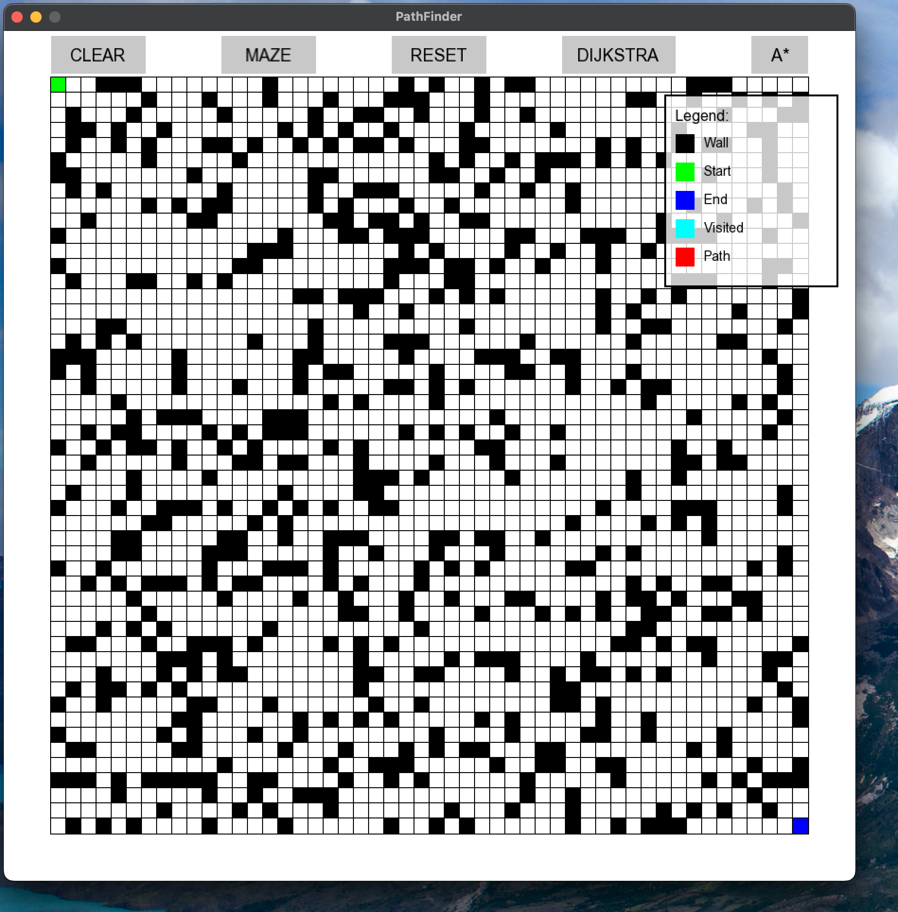

# PathFinder Visualization

This project is a graphical visualization of pathfinding algorithms using SFML (Simple and Fast Multimedia Library). It demonstrates how **A\*** and **Dijkstra's** algorithms work in finding the shortest path between two points on a grid. The application allows users to interactively place walls, move start and end points, and visualize the pathfinding process in real-time.

## Table of Contents

- [Features](#features)
- [Screenshots](#screenshots)
- [Getting Started](#getting-started)
  - [Prerequisites](#prerequisites)
  - [Installation](#installation)
  - [Building the Project](#building-the-project)
- [Usage](#usage)
  - [Controls](#controls)
  - [Buttons](#buttons)
- [Project Structure](#project-structure)
- [Contributing](#contributing)
- [License](#license)
- [Acknowledgments](#acknowledgments)

## Features

- **Interactive Grid**: A grid where users can place walls and move the start and end points.
- **Pathfinding Algorithms**: Visualize A\* and Dijkstra's algorithms.
- **Solid Buttons**: User-friendly buttons to control the application.
- **Legend Overlay**: A semi-transparent overlay explaining the color codes.
- **Embedded Assets**: Font assets are embedded into the binary for ease of distribution.
- **Grid Lines**: Clear grid lines to enhance visibility.

## Pathfinding Visualizer Screenshots

### Start Screen
This is the initial interface with options to run different algorithms like A* and Dijkstra.


### Generated Maze
The maze is created using the random maze generator before pathfinding begins.


### Dijkstra Algorithm
Here, the Dijkstra algorithm is applied to find the shortest path in the maze.


### A* Algorithm
The A* algorithm is applied to find a more optimal path.


### Tricky End - A* Algorithm
This screenshot shows a more complex layout with the A* algorithm finding a path.


### Tricky End - Dijkstra Algorithm
A more complex layout solved by the Dijkstra algorithm.


### Tricky Maze
The generated tricky maze before running any algorithm.


## Getting Started

These instructions will help you get a copy of the project up and running on your local machine.

### Prerequisites

- **C++ Compiler**: Supports C++11 or later.
- **CMake**: Version 3.10 or higher.
- **SFML Library**: Version 2.5 or higher.
- **Git** (optional): For cloning the repository.

### Installation

1. **Clone the Repository**

```bash
git clone https://github.com/yourusername/PathFinder.git
cd PathFinder
```

#### Download SFML

Download SFML from the official website.
Install it and note the installation path.

```
#for Mac
brew install sfml
```

#### Building the Project

##### Create a Build Directory

```bash
mkdir build 
cd build 
cmake .. 
cd ..
```

##### Configure the Project with CMake

```bash
cmake .. -DCMAKE_BUILD_TYPE=Release -DSFML_DIR=/path/to/SFML/lib/cmake/SFML
```

Replace /path/to/SFML with the actual path where SFML is installed on your system.

##### Build the Project

```bash
cmake --build ./build
```

##### Run the Application

```bash
./build/PathFinder
```

On Windows, the executable will be PathFinder.exe.

### Usage

#### Controls

**Left Mouse Button:**
- Click and Drag on Start Tile: Move the start point.
- Click and Drag on End Tile: Move the end point.
- Click on Grid: Place walls.

**Right Mouse Button:**
- Click on Grid: Remove walls.

#### Buttons

- **CLEAR**: Removes all walls from the grid.
- **MAZE**: Generates a random maze.
- **RESET**: Resets the grid and algorithms without removing walls.
- **DIJKSTRA**: Runs Dijkstra's algorithm to find the shortest path.
- **A***: Runs the A* algorithm to find the shortest path.

#### Legend

- **Wall**: Gray tiles represent walls or obstacles.
- **Start**: Green tile indicates the starting point.
- **End**: Red tile indicates the ending point.
- **Visited**: Light blue tiles show the nodes visited during the search.
- **Path**: Yellow tiles represent the shortest path found.

### Project Structure

```css
PathFinder/
├── CMakeLists.txt
├── README.md
├── include/
│   ├── AStar.h
│   ├── Button.h
│   ├── Dijkstra.h
│   ├── Graph.h
│   ├── Grid.h
│   └── Node.h
├── src/
│   ├── AStar.cpp
│   ├── Button.cpp
│   ├── Dijkstra.cpp
│   ├── Graph.cpp
│   ├── Grid.cpp
│   ├── Node.cpp
│   └── main.cpp
├── assets/
│   └── fonts/
│       └── Arial.ttf (Now embedded/ not needed)
```

- **include/**: Contains header files.
- **src/**: Contains source files.
- **assets/**: Contains embedded assets (fonts).

### Acknowledgments

- SFML: For providing a simple and fast multimedia library.
- OpenAI's ChatGPT: Assistance in code documentation.

### Additional Notes

#### Embedding Fonts

The font used in this application is embedded directly into the binary. This is achieved by converting the font file into a byte array and loading it into sf::Font using loadFromMemory().
Ensure that the font used is free to distribute and embed. Open-source fonts like DejaVu Sans or Liberation Sans are recommended.

#### Customization

- **Grid Size**: You can adjust the `mapSize` variable in `main.cpp` to change the grid dimensions.
- **Window Size**: Modify the `windowSize` variable for different window dimensions.
- **Colors**: Customize the colors in `Grid.h` and `Grid.cpp` to change the appearance.

### Potential Improvements

- **Algorithm Selection**: Add more pathfinding algorithms like BFS or DFS.
- **Animations**: Animate the pathfinding process step by step.
- **GUI Enhancements**: Integrate a GUI library like TGUI for more advanced interface elements.
- **Error Handling**: Improve feedback when no path is found.

### Improvements I Am working on

- **Concurrency**: Adding concurrent data structures, to enable stop the pathfinding mid-process, also make the pathfinding faster

### Troubleshooting

- **Linker Errors**: Ensure all source files are included in the `CMakeLists.txt`.
- **SFML Not Found**: Double-check the SFML installation path and that it matches the version specified.
- **Font Issues**: If the application cannot find the font, verify that the font data is correctly embedded and the paths are accurate.
